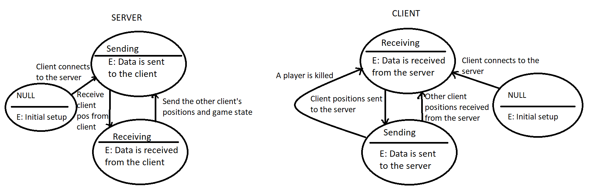

## Protocol Documentation
The server and the client open TCP sockets that listen for TCP connections on a specified port. A connection is established from a client to the server, and the data sent from the client to the server (as well as from the server to the client) is in binary format (bytes). More specifically, an immutable array of bytes is constructed from a JSON formatted string encoded using UTF-8 encoding.

The JSON formatted string is constructed by a predetermined dictionary form. The dictionary looks like this: 
`{ "xPos": int, "yPos": int, "gameOver": int }`. The xPos and yPos values have to lie between 0 - 800 and 0 - 300 respectively, which is the size of the game board. The gameOver value is either 0, if the game is still going, or 1, if the game has ended. 

When a player kills the other player, and thus wins the game, the client of the winning player sends it's positions as usual, but with the gameOver field set to 1. The server then sends the first clients position, with the gameOver field set to 1, to the other client. When the client receieves a message from the server with gameOver set to 1, it knows that the other client has won the game. 

When a client is connected to the server, a thread is opened to handle the connection for that client. The threads opened for the different clients that connect to the server run concurrently. When the client connects to the server for the first time, the starting positions for the connected player are sent from the server to the client. The client then keeps track of the coordinates of the player and sends this information to the server. It also sends information that pertains to the game state (if the game is over or not). When the server receives this data, the position of the connected client (player) is updated to the values received from that client. The server then proceeds to send to the client the current position of the other client (player), as well as the current game state that is always included in the data being sent.

Below is a state diagram describing what states the client and server can be in as well as what causes the transition from one state to another:

It should be noted that the client goes from the NULL state to the receiving state when a client connects to the server AND the client receives the initial values (starting positions and game state) from the server. The server meanwhile goes from the NULL state to the sending state when a client connects to the server AND the server sends the initial values to the client.

